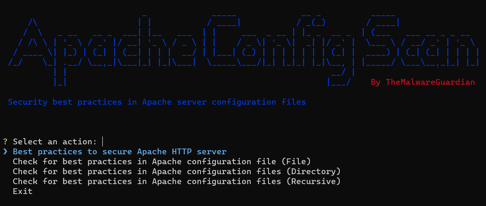

# Apache Config Scan


## Description

A Python script designed to assess and enforce security best practices in Apache server configuration files. This tool helps analysts to identify and verify the implementation of recommended security measures, ensuring the Apache server follows established guidelines for optimal security.


## Requirements

- [Python3](https://www.python.org/)


## Installation

```
git clone https://github.com/TheMalwareGuardian/ApacheConfigScan
cd ScanTool/
python -m venv venv
pip3 install -r requirements.txt
source venv/bin/activate or venv\Scripts\activate
```


## Usage

```
python main.py
```

<div style="text-align:center"></div>


## References

- [Web Apache: Security Tips](https://httpd.apache.org/docs/2.4/es/misc/security_tips.html)
- [Web Tecmint: 18 Apache Web Server Security and Hardening Tips](https://www.tecmint.com/apache-security-tips/)
- [Web Geekflare: Apache Web Server Hardening and Security Guide](https://geekflare.com/apache-web-server-hardening-security/)
- [Web Acunetix: Apache Security - 10 Tips for a Secure Installation](https://www.acunetix.com/blog/articles/10-tips-secure-apache-installation/)
- [Blog Medium: Apache Server Security Best Practices](https://medium.com/bobble-engineering/apache-server-security-best-practices-bec7b2b3b8a7)
- [Youtube Video: Incibe - Hardening básico de Apache](https://www.youtube.com/watch?v=rjsgaxV8irM)
- [Web CIS Benchmarks: Apache HTTP Server](https://www.cisecurity.org/benchmark/apache_http_server)
